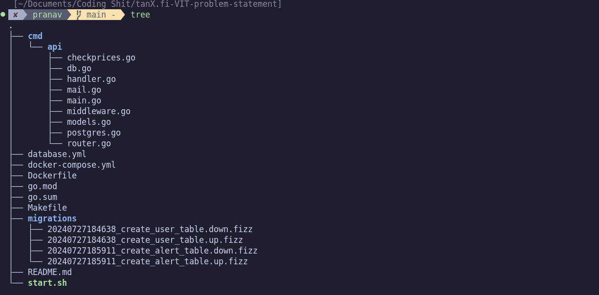

# BTC Alert System

# Instructions to Run the Applications

To run this app,first git clone this repo and then cd into it.Make sure your docker daemon is running and there is nothing running in port 8000 and port 5432.If there is something running on one of these ports say,5432, run `sudo lsof -i:5432` and figure out the ID(Lets say 1234) of the process running on that port. Then run `sudo kill 1234` to kill that particular process.Now that both of these ports are free, run `docker compose up --build` in the root directory.After the containers are up and running you should see the following on the terminal 

```
Server running on 8000
Connected to Postgres
The Current price of BTC is {}
```

I have made the app in such a way that the Current Price of BTC is shown every minute to make testing of the app easier.

# Architecture of the Application



In the root directory, lies a cmd directory which in turn contains the API directory which contains all my go code.This includes the main function, the handler and the database code and they all belong to the same package.My decision to not split them into seperate packages solely stems from the fact that this is an simple API and I made the decision to not make it complex thereby making it more readable.

The root directory,also contains the migrations folder. This has the specifications of the database migration you want to do. I use soda for all my database migrations (You can use it by installing `$ go install github.com/gobuffalo/pop/v6/soda@latest`). There is also the database.yml file that contains the configuration of the database for the Database migrations.

There is also the DockerFile and the docker-compose.yml. The Dockerfile contains the specification on how the Docker Image should be built and the docker-compose.yml file tells how the containers should be configured and built.

## EndPoints

**/register** - Registers an user to the database. Example of request body 
```
{
  "username":"vk",
  "password":"vk"
}
```

**/login** - Logins a user to the database. Without loggin in one cannot do anything.Example of request body 
```
{
  "username":"vk",
  "password":"vk"
}
```

**/alerts/create** - Creates an alert in the database. Make sure the request body has a Price in it.Example of request body 
```
{
  "price":5342
}
```

**/alerts/delete** - Marks an alert as deleted in the status section. Make sure to give the AlertID in the request body.Example of request body 
```
{
  "alertid":2
}
```
**/alerts/list** - Lists all the alerts


